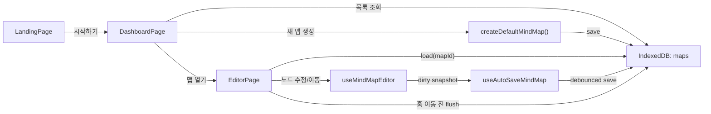

# mind_oribt_mvp Sprint 6 MVP 구현 계획

## 0. 기준점

이 계획은 현재 실제 코드베이스를 기준으로 작성한다.

현재 상태:

- `src/main.tsx`에서 `App` 하나만 마운트한다.
- `src/app/App.tsx`는 빈 Fragment를 반환한다.
- `src/index.css`, `src/app/App.css`는 비어 있다.
- 라우팅, 상태관리, 스토리지, 캔버스, 컴포넌트 구조가 없다.
- `package.json`에는 `react`, `react-dom`만 런타임 의존성으로 존재한다.
- `npm run build`는 `vite.config.ts` 부재로 실패한다.

즉, 이번 계획은 “기존 앱을 리팩터링”하는 계획이 아니라, “현재 빈 스캐폴드를 실제 MVP 구조로 확장”하는 계획이다.

이 문서는 PRD의 Sprint 6 범위를 구현 대상으로 삼는다.

- 모바일 우선 오프라인 마인드맵
- `IndexedDB` 기반 자동 저장
- 랜딩 -> 대시보드 -> 에디터 사용자 여정
- 심미적인 모바일 UX
- PC는 보조 경로로 지원

### 0.1 2026-04-14 구현 점검 체크리스트

- [x] `vite.config.ts` 추가 및 `@xyflow/react`, `idb` 의존성 반영
- [x] `DeviceClass`, `ActiveSheet`, `AppMetaRecord`를 포함한 타입 계층 구현
- [x] `IndexedDB` 기반 `maps`/`meta` 저장소와 최근 화면 복구 로직 구현
- [x] `LandingPage` -> `DashboardPage` -> `EditorPage` 상태 전환 구현
- [x] 대시보드의 목록 조회, 생성, 삭제, 최근 수정일 표시 구현
- [x] React Flow 기반 캔버스, 노드 추가/편집/삭제/이동, 파생 edge 계산 구현
- [x] 자동 저장 debounce, `pagehide`/`visibilitychange` flush, 홈 이동 직전 flush 구현
- [x] 모바일 FAB, 상단 캡슐 툴바, 하단 액션 독, 선택 시 인라인 액션, 바텀시트 UI 구현
- [x] `useResponsiveMode` 기반 `mobile`/`tablet`/`desktop` 반응형 전환과 키보드 inset 보정 구현
- [x] stale `lastOpenedMapId` 정리, 에러 바운더리 복구 버튼, 키보드 겹침 보정 반영
- [x] 금지된 최상위 타입 없이 타입 검증 통과
- [x] `npm run build`, `npm run lint` 통과
- [x] 390x844 모바일에서 랜딩 -> 대시보드 -> 생성 시트 -> 에디터 -> 노드 추가/편집 -> 새로고침 복구 흐름 검증
- [x] 768x1024 태블릿 레이아웃 검증
- [x] 1280x800 데스크톱 레이아웃과 단축키 힌트 노출 검증

---

## 1. 접근 방식 상세 설명

### 1.1 구현 원칙

이번 스프린트는 속도와 안정성이 핵심이므로, 현재 코드베이스의 장점을 살려 다음 원칙으로 구현한다.

- 기존 Vite + React + TypeScript 스택을 유지한다.
- 서버 없이 동작하는 완전 로컬 구조로 간다.
- 페이지 라우팅은 외부 라우터 대신 앱 내부 상태 머신으로 처리한다.
- 캔버스는 직접 구현하지 않고 `React Flow` 계열 라이브러리를 사용한다.
- 저장은 명시적 버튼이 아닌 자동 저장 훅으로 처리한다.
- 데이터는 `IndexedDB`에 저장하고, 마지막 열었던 맵 정보도 함께 저장한다.
- 모바일 UX가 우선이므로 데스크톱보다 터치 인터랙션과 단순 UI에 집중한다.

### 1.2 왜 이 방식이 현재 코드베이스에 맞는가

현재 저장소는 기능이 거의 없는 대신 구조 제약도 거의 없다. 따라서 다음 선택이 가장 효율적이다.

- `react-router-dom` 없이 `screen` 상태만으로 랜딩/대시보드/에디터를 전환
- `IndexedDB`를 직접 감싸는 작은 저장소 계층 추가
- `App`를 화면 전환 셸로 바꾸고, 기능은 feature 폴더로 분리
- 캔버스/제스처 복잡도는 직접 구현하지 않고 검증된 라이브러리로 줄임

### 1.3 핵심 아키텍처 변경 사항

현재:

```text
main.tsx -> App.tsx -> (빈 화면)
```

목표:

```text
main.tsx
  -> AppErrorBoundary
     -> App Shell
        -> LandingPage | DashboardPage | EditorPage
           -> IndexedDB hooks / map operations / canvas UI
```

즉, 단일 빈 루트 컴포넌트 구조를 아래 4개 층으로 분리한다.

- 앱 셸 계층: 화면 전환, 전역 에러 처리
- 화면 계층: 랜딩 / 대시보드 / 에디터
- 도메인 계층: 마인드맵 타입, 노드 조작 로직
- 영속성 계층: `IndexedDB` 읽기/쓰기, 자동 저장

### 1.4 선택할 구현 기술

추가 의존성 제안:

- `@xyflow/react`
- `idb`

선택 이유:

- `@xyflow/react`: 핀치 줌, 패닝, 드래그 이동, 노드 렌더링 등 캔버스 기본기를 빠르게 확보 가능
- `idb`: 브라우저 기본 IndexedDB API보다 코드가 짧고 타입 안정성이 좋아서 자동 저장 구현 리스크를 줄임

예상 `package.json` 변경 예시:

```json
{
  "dependencies": {
    "@xyflow/react": "x.x.x",
    "idb": "x.x.x",
    "react": "^19.2.4",
    "react-dom": "^19.2.4"
  }
}
```

### 1.5 라우팅 전략

이번 스프린트에서는 외부 라우터를 넣지 않고 `App` 내부 상태로 화면을 전환한다.

이유:

- 현재 앱은 단일 플로우만 필요하다.
- URL 딥링크나 브라우저 히스토리 복잡성이 아직 요구사항에 없다.
- 모바일 중심 MVP에서 가장 빠른 구현 경로다.

예상 코드 형태:

```tsx
// src/app/App.tsx
type Screen =
  | { name: 'landing' }
  | { name: 'dashboard' }
  | { name: 'editor'; mapId: string };

function App() {
  const [screen, setScreen] = useState<Screen>({ name: 'landing' });

  if (screen.name === 'landing') {
    return <LandingPage onStart={() => setScreen({ name: 'dashboard' })} />;
  }

  if (screen.name === 'dashboard') {
    return (
      <DashboardPage
        onOpenMap={(mapId) => setScreen({ name: 'editor', mapId })}
      />
    );
  }

  return (
    <EditorPage
      mapId={screen.mapId}
      onGoHome={() => setScreen({ name: 'dashboard' })}
    />
  );
}
```

### 1.6 데이터 모델 전략

PRD 기준 MVP에는 “트리 구조 + 자유 배치 + 자동 저장”이 필요하다. 이를 위해 저장 모델은 단순하지만 충분해야 한다.

선택:

- 맵 1개는 `nodes` 배열과 `viewport` 정보를 가진 단일 레코드로 저장
- 노드는 `parentId`를 가져 트리 관계를 표현
- 엣지는 영구 저장하지 않고 `parentId`에서 매번 파생

이 방식의 장점:

- `IndexedDB` 저장 구조가 단순하다
- 복구가 쉽다
- React Flow `edges`를 계산으로 만들 수 있다

예상 타입:

```ts
// src/types/mindmap.ts
export interface MindMapNodeRecord {
  id: string;
  parentId: string | null;
  text: string;
  position: { x: number; y: number };
}

export interface MindMapRecord {
  id: string;
  title: string;
  createdAt: string;
  updatedAt: string;
  rootNodeId: string;
  nodes: MindMapNodeRecord[];
  viewport: { x: number; y: number; zoom: number };
}
```

### 1.7 자동 저장 전략

자동 저장은 “입력할 때마다 즉시 DB 트랜잭션”이 아니라, “짧은 debounce + 이탈 시 flush”로 구현한다.

이유:

- 텍스트 입력 중 매 키스트로크마다 IndexedDB write를 발생시키면 모바일에서 끊김이 생길 수 있다.
- 반면 너무 길게 모으면 복구 신뢰성이 떨어진다.

기본 전략:

- 편집 시 `dirty = true`
- 300~500ms debounce 저장
- `blur`, 홈 이동, 페이지 언마운트 직전에 강제 flush
- 저장 중 새 변경이 생기면 최신 스냅샷만 다시 예약

예상 훅 형태:

```ts
// src/hooks/useAutoSaveMindMap.ts
export function useAutoSaveMindMap(map: MindMapRecord | null, dirty: boolean) {
  useEffect(() => {
    if (!map || !dirty) return;

    const timerId = window.setTimeout(() => {
      void saveMindMap(map);
    }, 400);

    return () => {
      window.clearTimeout(timerId);
    };
  }, [map, dirty]);
}
```

### 1.8 캔버스 전략

캔버스는 `@xyflow/react`를 사용한다. 직접 구현하지 않는 이유는 다음과 같다.

- 핀치 줌/패닝/드래그는 직접 만들수록 모바일 디버깅 비용이 커진다.
- 현재 PRD의 가장 중요한 리스크는 터치 UX다.
- 이미 검증된 캔버스 엔진을 쓰는 편이 Sprint 6에 맞다.

예상 코드 형태:

```tsx
// src/features/editor/MindMapCanvas.tsx
<ReactFlow
  nodes={flowNodes}
  edges={flowEdges}
  nodeTypes={nodeTypes}
  fitView
  panOnDrag
  zoomOnPinch
  zoomOnScroll={false}
  preventScrolling
  onNodesChange={handleNodesChange}
  onNodeDragStop={handleNodeDragStop}
/>
```

### 1.9 저장소 계층 전략

`IndexedDB`에는 최소 2개 object store를 둔다.

- `maps`: 마인드맵 본문 저장
- `meta`: 마지막으로 열었던 맵 ID, 앱 상태 메타 저장

예상 코드 형태:

```ts
// src/lib/db.ts
import { openDB } from 'idb';

export const dbPromise = openDB('mind-orbit', 1, {
  upgrade(db) {
    if (!db.objectStoreNames.contains('maps')) {
      db.createObjectStore('maps', { keyPath: 'id' });
    }

    if (!db.objectStoreNames.contains('meta')) {
      db.createObjectStore('meta', { keyPath: 'key' });
    }
  },
});
```

### 1.10 MindMeister 벤치마크 반영 원칙

제공된 영상에서 확인한 MindMeister 모바일 UX의 핵심 패턴은 다음과 같다.

- 대시보드는 어두운 배경 위에 카드와 하단 생성 시트를 겹쳐 보여준다.
- 상단 유틸리티는 매우 작고 밀도 있게 배치된다.
- 에디터는 거의 전체 화면을 흰 캔버스에 할당한다.
- 좌상단에는 검은 원형 뒤로가기 버튼 하나만 강하게 둔다.
- 우상단에는 검은 캡슐형 툴바를 두고, undo/정보/스타일/공유 같은 액션을 묶는다.
- 하단 중앙에는 검은 캡슐형 액션 독을 고정하고, 주변에는 원형 보조 액션을 분리해 둔다.
- 노드를 선택했을 때만 파란 선택 테두리, 작은 인라인 버튼, 초록색 추가 핸들 같은 세부 조작 UI가 나타난다.
- 테마/아이콘/컨텍스트 메뉴는 전체 화면 전환 대신 바텀시트로 열린다.
- 키보드 편집 중에도 선택된 노드와 액션 바가 시야에 남도록 배치되어 있다.
- 전체적으로 여백이 매우 넓고, 연결선은 얇고, 노드는 부드러운 라운드 직사각형이다.

이 벤치마크를 우리 MVP에 반영할 때의 핵심 해석은 다음과 같다.

- 화면 대부분은 항상 캔버스가 차지해야 한다.
- 도구는 상시 패널이 아니라 작은 떠 있는 레이어로만 존재해야 한다.
- 세부 액션은 “항상 노출”이 아니라 “선택 시에만 노출”해야 한다.
- 모바일에서는 모달보다 바텀시트가 더 자연스럽다.
- 노드 편집 중 키보드가 올라와도 작업 맥락이 끊기면 안 된다.

### 1.11 벤치마크에서 채택할 것과 채택하지 않을 것

Sprint 6에서 채택:

- 풀 캔버스 중심 레이아웃
- 좌상단 원형 뒤로가기 버튼
- 우상단 소형 캡슐 툴바
- 하단 중앙 액션 독
- 선택 시에만 나타나는 인라인 조작 affordance
- 바텀시트 기반 부가 액션
- 넓은 여백, 부드러운 연결선, 얇은 시각적 무게
- 키보드가 떠도 선택 노드가 보이는 편집 동선

Sprint 6에서 의도적으로 제외:

- 팀/공유/협업 기능
- 유료 업셀 흐름
- 복잡한 템플릿 종류
- 아이콘 라이브러리의 전체 범위
- 댓글/코멘트 기능
- 고도화된 테마 시스템

즉, 우리는 MindMeister의 “모바일 사용감과 레이아웃 문법”은 가져오되, 제품 범위를 넓히는 기능 표면은 가져오지 않는다.

---

## 2. 변경될 코드 구조

### 2.1 목표 디렉터리 구조

```text
src/
  app/
    App.tsx
    App.css
    AppErrorBoundary.tsx
  features/
    landing/
      LandingPage.tsx
      LandingPage.css
    dashboard/
      DashboardPage.tsx
      DashboardPage.css
      CreateMapSheet.tsx
    editor/
      EditorPage.tsx
      EditorPage.css
      EditorTopBar.tsx
      EditorActionDock.tsx
      EditorBottomSheet.tsx
      MindMapCanvas.tsx
      MindMapNode.tsx
      FloatingAddButton.tsx
  hooks/
    useMindMapsIndex.ts
    useMindMapEditor.ts
    useAutoSaveMindMap.ts
  lib/
    db.ts
    createDefaultMindMap.ts
    mapOperations.ts
  types/
    mindmap.ts
  main.tsx
  index.css
vite.config.ts
```

### 2.2 구조 변경 설명

기존에는 `App.tsx` 하나에 모든 것이 들어갈 예정이었지만, 실제 구현 시 아래처럼 역할을 분리한다.

- `app/`
  - 앱 셸, 전역 에러 처리, 화면 전환
- `features/landing`
  - 첫 진입 화면과 “시작하기” 진입점
- `features/dashboard`
  - 맵 목록, 생성, 삭제, 하단 생성 시트
- `features/editor`
  - 마인드맵 캔버스, 상단 소형 툴바, 하단 액션 독, 바텀시트, 노드 편집
- `hooks/`
  - 자동 저장, 대시보드 조회, 에디터 상태 조립
- `lib/`
  - `IndexedDB` 접근과 노드 CRUD 계산 로직
- `types/`
  - 데이터 구조 정의

### 2.3 아키텍처 변경 전후 비교

변경 전:

```text
UI
  -> App.tsx
```

변경 후:

```text
UI Shell
  -> LandingPage / DashboardPage / EditorPage
     -> hooks
        -> lib/db.ts
        -> lib/mapOperations.ts
           -> types/mindmap.ts
```

즉, 기능 추가가 아니라 “앱 구조 생성”에 가까운 변경이 들어간다.

---

## 3. 파일 단위 변경 계획

아래는 실제 수정/생성 대상 파일과 목적이다.

| 파일 경로 | 변경 유형 | 목적 | 핵심 내용 |
| --- | --- | --- | --- |
| `package.json` | 수정 | 필수 의존성 추가 | `@xyflow/react`, `idb` 추가 |
| `vite.config.ts` | 생성 | 빌드 복구 및 React 플러그인 연결 | `react()` 플러그인 등록 |
| `src/main.tsx` | 수정 | 전역 에러 경계 및 캔버스 CSS 연결 | `AppErrorBoundary` 또는 라이브러리 스타일 import |
| `src/index.css` | 수정 | 전역 토큰/리셋/모바일 기본 스타일 | 배경색, 폰트, 버튼/입력 기본 규칙 |
| `src/app/App.tsx` | 수정 | 화면 상태 머신 구현 | 랜딩/대시보드/에디터 전환 |
| `src/app/App.css` | 수정 | 앱 셸 공통 레이아웃 | full-height layout, safe-area, transition |
| `src/app/AppErrorBoundary.tsx` | 생성 | 예기치 못한 렌더링 오류 보호 | fallback UI 제공 |
| `src/types/mindmap.ts` | 생성 | 도메인 타입 정의 | 맵, 노드, 뷰포트 타입 |
| `src/lib/db.ts` | 생성 | `IndexedDB` 접근 계층 | open, get, list, save, delete, meta |
| `src/lib/createDefaultMindMap.ts` | 생성 | 새 맵 초기값 생성 | root 노드 포함 기본 레코드 생성 |
| `src/lib/mapOperations.ts` | 생성 | 노드 CRUD 계산 로직 | child/sibling add, delete, update, move |
| `src/hooks/useMindMapsIndex.ts` | 생성 | 대시보드 목록 조회/갱신 | 정렬, 생성, 삭제, 재조회 |
| `src/hooks/useMindMapEditor.ts` | 생성 | 에디터 상태 조립 | 맵 로드, 노드 수정, dirty 관리 |
| `src/hooks/useAutoSaveMindMap.ts` | 생성 | 백그라운드 자동 저장 | debounce, flush, save status |
| `src/features/landing/LandingPage.tsx` | 생성 | 첫 진입 화면 | 제품 메시지 + 시작 버튼 |
| `src/features/landing/LandingPage.css` | 생성 | 랜딩 화면 스타일 | breathable hero layout |
| `src/features/dashboard/DashboardPage.tsx` | 생성 | 맵 목록/생성/삭제 | 카드형 목록, 새 맵 CTA |
| `src/features/dashboard/DashboardPage.css` | 생성 | 대시보드 스타일 | 어두운 배경, 카드 목록, 하단 시트가 겹치는 모바일 레이아웃 |
| `src/features/dashboard/CreateMapSheet.tsx` | 생성 | 대시보드 하단 생성 시트 | MindMeister식 하단 시트 패턴을 단순화한 맵 생성 진입 |
| `src/features/editor/EditorPage.tsx` | 생성 | 편집 화면 조립 | 헤더, 홈 버튼, 저장 상태, FAB, canvas |
| `src/features/editor/EditorPage.css` | 생성 | 에디터 화면 스타일 | 흰 캔버스 중심, safe-area, 떠 있는 헤더/독 레이아웃 |
| `src/features/editor/EditorTopBar.tsx` | 생성 | 우상단 캡슐 툴바 | undo, info, style 진입 등 최소 액션만 배치 |
| `src/features/editor/EditorActionDock.tsx` | 생성 | 하단 중앙 액션 독 | 추가, 스타일, 더보기 등 모바일 주요 액션 집중 |
| `src/features/editor/EditorBottomSheet.tsx` | 생성 | 테마/더보기/보조 액션 시트 | 전체 화면 전환 대신 바텀시트로 열리는 보조 UI |
| `src/features/editor/MindMapCanvas.tsx` | 생성 | React Flow 캔버스 래퍼 | nodes/edges 변환, drag/zoom/pan |
| `src/features/editor/MindMapNode.tsx` | 생성 | 커스텀 노드 렌더러 | 모바일 친화적 텍스트 편집 노드 |
| `src/features/editor/FloatingAddButton.tsx` | 생성 | 모바일 보조 추가 UI | 하단 액션 독을 보완하는 우측 보조 FAB 또는 빠른 추가 진입 |

### 3.1 우선 구현 순서

1. [x] 빌드 복구
2. [x] 타입/DB/기본 데이터 생성기
3. [x] 대시보드 로직
4. [x] 에디터 상태/자동 저장
5. [x] React Flow 캔버스
6. [x] 상단 툴바/하단 액션 독/바텀시트 구축
7. [x] 모바일 FAB/스타일 정교화
8. [x] QA 기준 점검

### 3.2 빌드 복구 우선 조치

가장 먼저 `vite.config.ts`를 추가해서 현재 깨져 있는 `npm run build`를 복구한다.

예상 코드:

```ts
// vite.config.ts
import { defineConfig } from 'vite';
import react from '@vitejs/plugin-react';

export default defineConfig({
  plugins: [react()],
});
```

이 변경은 기능 구현 이전에 필수다. 제출 직전에 빌드가 깨져 있으면 QA 자체가 흔들린다.

---

## 4. 데이터 흐름

### 4.1 앱 시작 흐름

```text
브라우저 진입
  -> main.tsx
  -> App
  -> LandingPage
  -> "시작하기"
  -> DashboardPage
  -> IndexedDB에서 maps 목록 조회
```

### 4.2 새 마인드맵 생성 흐름

```text
DashboardPage
  -> "새 마인드맵" CTA 클릭
  -> CreateMapSheet 오픈
  -> 기본 생성 옵션 선택
  -> createDefaultMindMap()
  -> saveMindMap()
  -> 목록 갱신
  -> EditorPage로 이동
```

예상 코드 흐름:

```ts
// src/lib/createDefaultMindMap.ts
export function createDefaultMindMap(): MindMapRecord {
  const rootId = crypto.randomUUID();
  const now = new Date().toISOString();

  return {
    id: crypto.randomUUID(),
    title: '새 마인드맵',
    createdAt: now,
    updatedAt: now,
    rootNodeId: rootId,
    viewport: { x: 0, y: 0, zoom: 1 },
    nodes: [
      {
        id: rootId,
        parentId: null,
        text: '중심 생각',
        position: { x: 0, y: 0 },
      },
    ],
  };
}
```

### 4.3 에디터 편집 흐름

```text
EditorPage 진입
  -> loadMindMap(mapId)
  -> useMindMapEditor가 메모리 상태 보관
  -> 노드 추가/편집/이동
  -> dirty = true
  -> useAutoSaveMindMap debounce 저장
  -> IndexedDB 업데이트
  -> 저장 상태 UI 반영
```

벤치마크 반영 상세:

- 상단 툴바는 캔버스를 가리지 않도록 우상단에 작은 캡슐형으로 고정
- 하단 액션 독은 중앙 고정, 선택 노드와 독 사이 거리 최소화
- 부가 옵션은 바텀시트로 열고 닫아 캔버스를 완전히 떠나지 않게 유지
- 선택되지 않은 노드에는 조작 UI를 숨겨 시야를 깨끗하게 유지

### 4.4 노드/엣지 생성 흐름

저장 구조는 `nodes`만 저장하고, 화면용 `edges`는 파생한다.

예상 코드:

```ts
// src/lib/mapOperations.ts
export function buildFlowEdges(nodes: MindMapNodeRecord[]) {
  return nodes
    .filter((node) => node.parentId)
    .map((node) => ({
      id: `${node.parentId}-${node.id}`,
      source: node.parentId as string,
      target: node.id,
      type: 'smoothstep',
    }));
}
```

선택 노드가 있을 때의 UI 흐름:

```text
노드 탭
  -> 선택 상태 활성화
  -> 파란 외곽선 노출
  -> 인라인 추가 affordance 노출
  -> 하단 액션 독 활성화
  -> child / sibling 추가 액션 실행
```

### 4.5 키보드 편집 흐름

```text
노드 탭
  -> 텍스트 편집 모드 진입
  -> 가상 키보드 오픈
  -> viewport를 선택 노드 기준으로 보정
  -> 노드와 하단 액션 독이 동시에 보이도록 여백 확보
  -> 입력 중 debounce auto-save
```

### 4.6 복구 흐름

```text
앱 재진입
  -> meta store에서 lastOpenedMapId 조회
  -> 해당 맵 존재 시 EditorPage 복구 또는 Dashboard에서 최근 맵 강조
  -> 맵 본문은 IndexedDB에서 복원
```

### 4.7 홈 이동 흐름

```text
EditorPage
  -> "홈" 클릭
  -> pending auto-save flush
  -> updatedAt 반영 저장
  -> DashboardPage 이동
  -> 목록 재조회 후 최신 수정 시간 표시
```

### 4.8 전체 데이터 흐름 다이어그램



---

## 5. 예외 처리 전략

### 5.1 IndexedDB 초기화 실패

상황:

- 브라우저가 IndexedDB를 비활성화했거나
- 저장소 초기화가 실패했거나
- 권한/보안 정책 문제로 open이 실패한 경우

대응:

- 앱 상단에 치명적 배너 표시
- 편집은 가능하되 “저장 비활성화” 상태를 명시
- 대시보드/에디터 주요 액션은 유지하되 영속 저장 불가를 안내

선택 이유:

- 앱 전체를 죽이는 것보다, 최소한의 편집 체험을 유지하는 편이 낫다.
- 다만 Sprint 6 성공 기준에는 저장 신뢰성이 포함되므로, QA에서는 실패 케이스로 분류한다.

### 5.2 저장 충돌 및 저장 중 추가 입력

상황:

- debounce 저장 도중 사용자가 계속 입력하는 경우

대응:

- 저장은 순차 큐로 처리
- 저장 중 새 변경이 생기면 최신 스냅샷만 다시 예약
- 성공 시 `lastSavedAt` 갱신

예상 코드 방향:

```ts
let pendingSave: Promise<void> = Promise.resolve();

function queueSave(snapshot: MindMapRecord) {
  pendingSave = pendingSave.then(() => saveMindMap(snapshot));
  return pendingSave;
}
```

### 5.3 존재하지 않는 맵 ID로 에디터 진입

상황:

- 삭제된 맵 ID를 들고 진입했거나
- meta에 남은 마지막 맵 정보가 stale한 경우

대응:

- 에디터에서 빈 화면을 보여주지 않고
- “맵을 찾을 수 없음” 메시지 후 대시보드로 복귀
- stale한 meta 값은 정리

### 5.4 루트 노드 삭제 시도

상황:

- 사용자가 root 노드를 삭제하려는 경우

대응:

- MVP에서는 루트 삭제를 막는다
- root 대신 텍스트 편집은 허용

선택 이유:

- 루트가 없는 마인드맵은 복구/렌더링 분기를 크게 늘린다.
- Sprint 6에서는 구조 안정성이 우선이다.

### 5.5 잘못된 노드 데이터

상황:

- `parentId`가 존재하지 않는 노드를 로드하거나
- position 정보가 비정상적인 경우

대응:

- 로드 시 sanitize 단계 수행
- 부모 없는 비루트 노드는 root 밑으로 재부착하거나 제외
- `NaN`/비정상 좌표는 기본값으로 치환

### 5.6 모바일 터치 제스처 충돌

상황:

- 브라우저 스크롤과 캔버스 pan/zoom이 충돌

대응:

- 에디터 캔버스 영역에 `touch-action: none`
- 페이지 전체 스크롤이 아니라 캔버스 중심 인터랙션으로 제한
- 헤더 높이와 safe-area를 고정해 조작 중 레이아웃 흔들림 방지

### 5.7 키보드와 편집 UI 겹침

상황:

- 키보드가 올라오면서 선택 노드가 가려지거나
- 하단 액션 독과 입력 중 노드가 충돌하는 경우

대응:

- 편집 진입 시 선택 노드의 스크린 좌표를 확인
- 키보드 높이를 반영해 viewport를 위로 보정
- 하단 액션 독은 키보드 위로 떠오르거나, 편집 중 최소형으로 축소

선택 이유:

- 벤치마크 영상에서 가장 중요한 장점 중 하나가 “입력 중에도 캔버스 맥락이 보인다”는 점이기 때문이다.

### 5.8 바텀시트 중첩 충돌

상황:

- 테마 시트, 더보기 시트, 생성 시트가 동시에 열리는 경우

대응:

- 전역적으로 하나의 activeSheet만 허용
- 새로운 시트를 열면 이전 시트를 닫음
- 시트가 열린 상태에서는 캔버스 탭 액션 일부를 비활성화

### 5.9 홈 이동 직전 미저장 데이터

상황:

- debounce 타이머가 남아 있는 상태에서 홈 이동

대응:

- `onGoHome` 직전 강제 `flushSave()`
- 저장 완료 후 대시보드 전환
- 실패 시 경고 표시 후 재시도 버튼 제공

### 5.10 예기치 못한 렌더링 에러

대응:

- `AppErrorBoundary` 추가
- 전체 앱 크래시 대신 fallback 화면 제공
- fallback에는 “대시보드로 돌아가기”와 “새로고침” 액션 제공

---

## 6. 변경될 코드 구조 상세

### 6.1 앱 셸

`src/app/App.tsx`는 더 이상 빈 루트가 아니라, 아래 역할을 맡는다.

- 현재 화면 상태 보관
- 랜딩/대시보드/에디터 렌더링 분기
- 화면 간 이동 핸들러 제공
- 복구 정책 연결

### 6.2 대시보드 계층

`DashboardPage`는 다음 책임만 가진다.

- 맵 목록 조회
- 새 맵 생성
- 맵 삭제
- 맵 열기

비즈니스 로직은 내부에 길게 두지 않고 `useMindMapsIndex`와 `db.ts`로 분리한다.

### 6.3 에디터 계층

`EditorPage`는 다음을 조립한다.

- 상단 헤더
- 홈 버튼
- 우상단 캡슐 툴바
- 저장 상태 표시
- `MindMapCanvas`
- `EditorActionDock`
- `EditorBottomSheet`
- `FloatingAddButton`

반면 실제 노드 수정 로직은 `useMindMapEditor`에서 처리한다.

벤치마크 반영 원칙:

- 상단과 하단의 떠 있는 조작층은 항상 캔버스를 압도하면 안 된다.
- 기본 상태에서는 캔버스가 주인공이고, 컨트롤은 배경이어야 한다.
- 선택 순간에만 세부 조작이 드러나도록 한다.

### 6.4 도메인/조작 로직 계층

`mapOperations.ts`에는 UI와 무관한 순수 함수만 둔다.

- `addChildNode`
- `addSiblingNode`
- `updateNodeText`
- `removeNode`
- `moveNode`
- `buildFlowEdges`

이 구조를 택하면 UI가 바뀌어도 핵심 조작 규칙은 재사용 가능하다.

예상 코드 방향:

```ts
// src/lib/mapOperations.ts
export function addChildNode(
  map: MindMapRecord,
  parentId: string,
): MindMapRecord {
  const newNode = {
    id: crypto.randomUUID(),
    parentId,
    text: '',
    position: { x: 180, y: 80 },
  };

  return {
    ...map,
    updatedAt: new Date().toISOString(),
    nodes: [...map.nodes, newNode],
  };
}
```

---

## 7. 트레이드오프

### 7.1 React Router 미도입

선택:

- 도입하지 않음

장점:

- 구현 속도가 빠름
- 파일 수와 개념 수를 줄일 수 있음
- 현재 PRD의 단일 흐름에 충분함

단점:

- URL 기반 딥링크 불가
- 브라우저 히스토리 연동이 제한적
- 이후 확장 시 다시 라우터 도입 가능성 있음

### 7.2 React Flow 사용

선택:

- 사용함

장점:

- 핀치 줌/패닝/드래그 구현 부담 감소
- 모바일 디버깅 리스크 절감
- 커스텀 노드 UI만 집중 구현 가능

단점:

- 라이브러리 학습 비용
- 번들 크기 증가
- 모바일 제스처 튜닝이 여전히 일부 필요

### 7.2.a MindMeister식 툴바/독 패턴 차용

선택:

- 차용하되 단순화

장점:

- 모바일에서 매우 빠르게 학습되는 구조
- 캔버스에 집중도를 유지할 수 있음
- 버튼 수를 적게 유지하면서도 편집 가능

단점:

- 잘못 복제하면 단순한 모방처럼 보일 수 있음
- 우리 제품 범위보다 툴 표면이 과해질 위험이 있음

보완:

- 공유, 댓글, 팀 기능은 제거
- Sprint 6에서는 `추가`, `스타일`, `더보기` 정도로 축소
- 시각 문법만 참고하고 기능 스코프는 PRD 기준으로 제한

### 7.3 `idb` 사용

선택:

- 사용함

장점:

- 브라우저 기본 IndexedDB API보다 코드가 훨씬 단순
- Promise 기반으로 훅과 연결하기 좋음
- 타입 안정성이 좋음

단점:

- 의존성 1개 추가
- 순수 브라우저 API만 쓰는 것보다 추상화 레이어가 생김

### 7.4 TypeScript 유지

선택:

- 유지함

장점:

- 현재 코드베이스와 일치
- 자동 저장과 데이터 복구처럼 구조가 중요한 기능에서 타입 안정성이 큼
- 협업 중 데이터 구조 변경 시 오류를 빨리 잡을 수 있음

단점:

- PRD의 `js/jsx` 협업 가이드와 약간 어긋날 수 있음
- 빠른 실험 코드 작성 속도는 약간 느릴 수 있음

판단:

- 현재 저장소가 이미 TS로 구성되어 있으므로, Sprint 6에서는 TS 유지가 리스크가 더 낮다.

### 7.5 저장 구조를 `nodes` 배열로 유지

선택:

- 저장 시 배열 유지, 엣지는 파생

장점:

- 직렬화가 단순
- IndexedDB 저장/복구가 단순
- React Flow 연결이 쉬움

단점:

- 대규모 노드 수에서 업데이트 성능이 최적은 아님
- 인덱싱 lookup은 보조 함수가 필요할 수 있음

판단:

- MVP 노드 규모에서는 단순성이 더 중요하다.

### 7.6 자동 저장 debounce

선택:

- 짧은 debounce 적용

장점:

- 모바일 입력 중 버벅임 완화
- 불필요한 IndexedDB write 감소

단점:

- 아주 짧은 순간에는 메모리 상태와 디스크 상태가 다를 수 있음

보완:

- `blur`, 홈 이동, 언마운트 직전 flush

### 7.7 테스트 전략 축소

선택:

- 이번 스프린트는 자동화 테스트보다 수동 QA 중심

장점:

- 마감에 맞춰 실제 UX 다듬기에 집중 가능
- PRD의 완성 기준과 정렬됨

단점:

- 회귀 검출 자동화가 약함

보완:

- `mapOperations.ts`는 순수 함수로 유지해 후속 스프린트에서 테스트 붙이기 쉽게 설계

### 7.8 바텀시트 채택

선택:

- 편집 보조 UI는 전면 페이지 이동 대신 바텀시트 사용

장점:

- 모바일 한 손 사용성이 좋음
- 사용자가 캔버스 맥락을 잃지 않음
- MindMeister 벤치마크와 가장 유사한 모바일 밀도를 확보 가능

단점:

- 시트 상태 관리가 늘어남
- 키보드/시트/캔버스 충돌 케이스를 신경 써야 함

판단:

- 이번 MVP의 모바일 품질 목표와 가장 잘 맞는다.

---

## 8. 권장 구현 순서

### 8.1 Step 1: 툴링 복구

- [x] `package.json` 의존성 추가
- [x] `vite.config.ts` 추가
- [x] `npm run build` 복구

### 8.2 Step 2: 데이터 계층 구현

- [x] `src/types/mindmap.ts`
- [x] `src/lib/db.ts`
- [x] `src/lib/createDefaultMindMap.ts`
- [x] `src/lib/mapOperations.ts`

### 8.3 Step 3: 앱 화면 골격 구현

- [x] `LandingPage`
- [x] `DashboardPage`
- [x] `EditorPage`
- [x] `App.tsx` 화면 전환

### 8.4 Step 4: 캔버스와 노드 편집 구현

- [x] `MindMapCanvas`
- [x] `MindMapNode`
- [x] 노드 CRUD / 이동 연결

### 8.5 Step 5: 자동 저장과 복구 구현

- [x] `useMindMapEditor`
- [x] `useAutoSaveMindMap`
- [x] `lastOpenedMapId` 복구

### 8.6 Step 6: 모바일 UX 다듬기

- [x] FAB
- [x] safe-area
- [x] touch-action
- [x] 모바일 spacing / shadow / button count 정리

### 8.7 Step 7: QA

- [x] 모바일 뷰포트에서 랜딩 -> 대시보드 -> 에디터 -> 노드 추가/편집 -> 새로고침 복구 검증
- [x] 홈 이동 전 flush 저장 경로 구현 확인
- [x] 생성/삭제/복구 시나리오 코드 경로 점검
- [x] 태블릿/데스크톱 반응형 레이아웃 검증

---

## 9. 완료 기준

이 계획이 구현으로 이어졌을 때 Sprint 6 완료로 볼 수 있는 조건은 다음과 같다.

- [x] 랜딩 -> 대시보드 -> 에디터 흐름이 동작한다.
- [x] 맵 생성/삭제/선택이 가능하다.
- [x] 노드 추가/편집/삭제/이동이 가능하다.
- [x] 모바일에서 핀치 줌, 패닝, FAB 추가가 자연스럽다.
- [x] 저장 버튼 없이 자동 저장된다.
- [x] 오프라인 새로고침 후 마지막 상태가 복구된다.
- [x] `npm run build`가 성공한다.

이 문서의 핵심은 “현재 빈 스캐폴드를 PRD에 맞는 모바일 우선 오프라인 마인드맵 MVP 구조로 확장하는 구체적인 설계”다.
